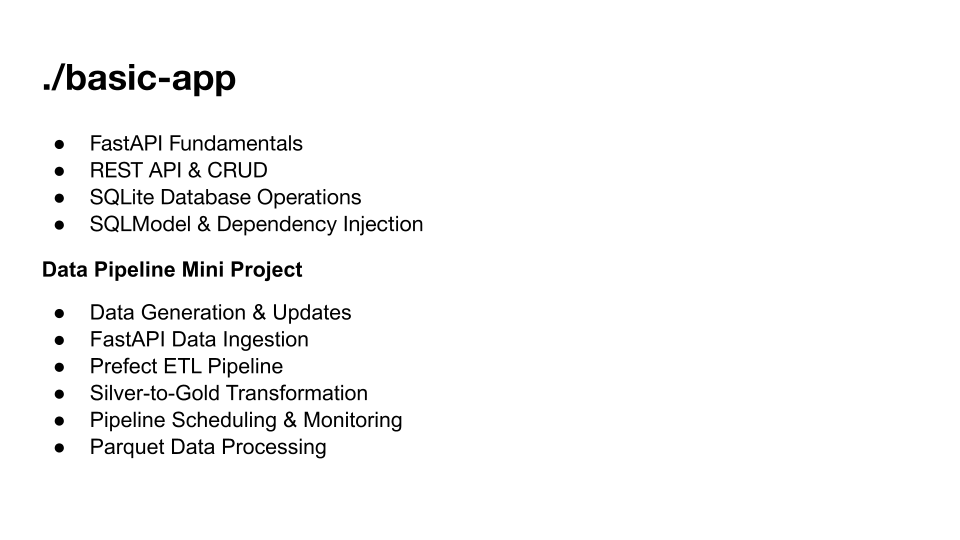

### V 1.0 This is a Claims Application for Understanding Medical Claim Insurance.

#### V1.0.0 Highlights

- Basic Claim Applciation
- CRUD Operations with Sample Dynamic Data
- Random Data Generator with End Points
- CRUD Operations + Total Claim Counter

#### V1.0.1
 - Stable Version of the FastAPI Application
 - Used sqlite3 for Database Operations
 - Using SQL Model for DB CRUD Operations for Persistent Data
 - Mini DE Project - Created Pipelines using Prefect.
