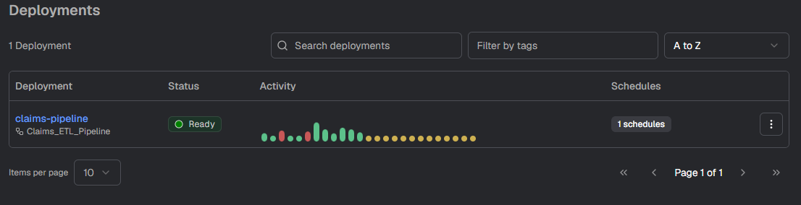
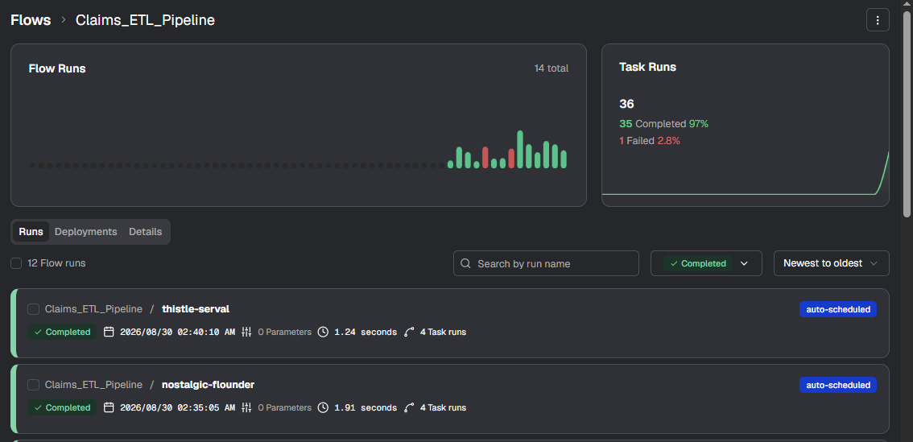
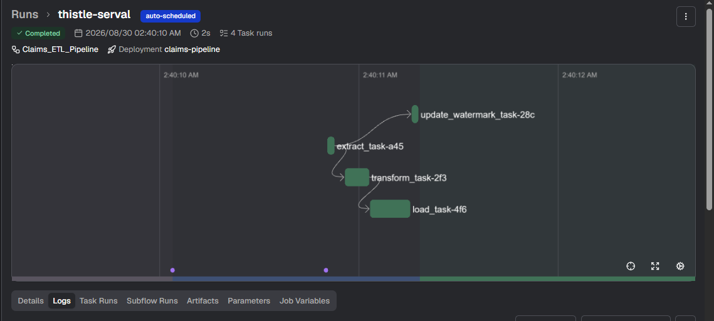
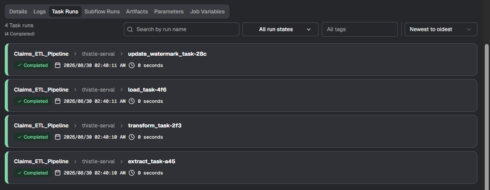

# Claims Application

A learning project built around a **medical insurance claims application**, gradually evolving from a basic FastAPI CRUD application into a broader backend, data engineering, and AI-enabled system.

The project is intentionally developed in versions, with each version introducing a new engineering concept.

---

## 🚀 Version 1.0.0 — Basic Claims Application - basic-app

- Basic medical insurance claims application.
- CRUD operations for claim records.
- Dynamic synthetic claim data generation.
- Total claim counter.
- Initial in-memory data handling.

---

## 🚀 Version 1.0.1 — FastAPI + Persistent Database - basic-appas

- Stable FastAPI application with persistent database storage.
- SQLite database with SQLModel.
- CRUD APIs for claims.

### Endpoints

| Endpoint | Description |
| --- | --- |
| `/get/claims` | Get claim data |
| `/add/claims` | Add a new claim |
| `/update/claims` | Update claim status |
| `/delete/claims` | Delete a claim |
| `/get/claims/latest` | Get latest claim |
| `/get/claims/latest_updated` | Get latest updated claim |
| `/get/claims/total` | Get total claim count and amount |
| `/get/all/claimIds` | Get all claim IDs |

- Includes a **Synthetic Data Generator** for continuously creating and updating claim records.

---

## 🚀 Data Engineering Pipeline

Added a **Prefect-based micro-batch data pipeline** for processing claims data.

```text
        Data Generator
              │
              ▼
          SQLite DB
        (Bronze Layer)
              │
        Every 3 minutes
              ▼
           Extract
              │
              ▼
          Transform
       (Pandas Aggregations)
              │
              ▼
            Load
              │
              ▼
       Parquet / Gold Layer
```

### Pipeline

- Incremental extraction using an audit timestamp watermark.
- Pandas-based transformations and aggregations.
- Status, TPA, month, claim type and location level metrics.
- Timestamped output folders for pipeline runs.
- Parquet output for analytical data.
- Prefect used for orchestration and scheduling.

---

## ▶️ Running the Application

### 1. Create Virtual Environment

```bash
python -m venv .venv
```

Activate the environment:

```powershell
.venv\Scripts\Activate.ps1
```

### 2. Install Dependencies

```bash
pip install -r requirements.txt
```

### 3. Start FastAPI

From the `basic-app` directory:

```bash
fastapi dev main.py
```

Open the API documentation:

- Scalar

[Fastapi Scalar Documentation URL](http://localhost:8000/scalar)

---

## ▶️ Running the Data Pipeline

The pipeline and data generator can be run independently from the FastAPI application.

### Terminal 1 — Start Prefect Server

```bash
prefect server start
```

### Terminal 2 — Start Claims Pipeline

```bash
python claims_flow.py
```

The pipeline is scheduled to run automatically at the configured interval.

### Prefect Dashboard

Open:

[Prefect Dashboard Localhost URL](http://127.0.0.1:4200/v2/)

The dashboard can be used to view:

Deployment



- Flow runs & Pipeline History



- Task execution and Run status



- Task Runs



### Data Generator

Run the synthetic data generator alongside the pipeline to simulate continuously arriving and updated claims data.

---

## PostgreSQL & Backend Architecture - app

- Added PostgreSQL integration with `SQLModel`, SQLAlchemy, and `asyncpg`.
- Configured database settings through environment variables using `pydantic-settings`.
- Added asynchronous database access with `AsyncSession`.
- Refactored API routes into an `APIRouter` for a cleaner, more modular structure.
- Introduced a Service Layer to keep database operations separate from route handlers.
- Refactored the backend into dedicated layers for routes, services, database models, and configuration.

---

## 🛠️ Current Tech Stack

- **Python**
- **FastAPI**
- **SQLModel**
- **SQLite**
- **Pandas**
- **Prefect**
- **Parquet**

---

## 🗺️ Roadmap

The application will continue evolving under the same project, with additional concepts introduced incrementally:

- Authentication & Authorization
- Advanced FastAPI concepts
- Data Engineering improvements
- AWS integration
- GenAI / LLM capabilities
- Production-oriented architecture
